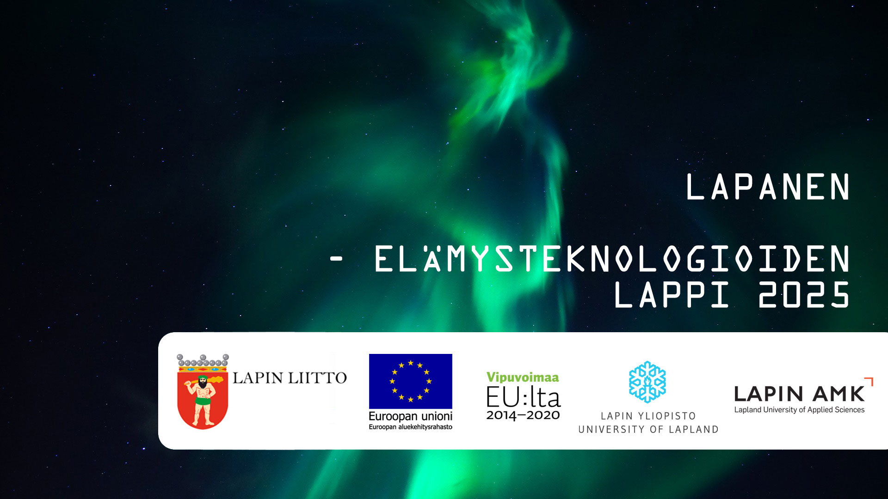

# AR-GPS-Tool
Tool for Unity to place 3D-objects into a AR-world based on GPS-coordinates.

# Requirements
- Requires Unity's AR Foundation. Project uses AR Foundation version 3 but it should also work with version 2 with minor modifications.
- AR Foundation/ARCore requires Android API level 24 (Android 7.0 'Nougat').
- Android smart phone must be in the [ARCore supported devices list](https://developers.google.com/ar/discover/supported-devices)

# Version
1.0.0

# Guide
Check "Demo Scene" for an example scene on how to setup the tool.

1. Add "AR GPS Tool" prefab to the scene. This contains the main components needed.
2. (Optional) Add "SupportCheck UI Canvas" prefab to the scene. This has the [Support Checker Component](#Support-Checker) which checks if the AR supported on the device.
3. (Optional) Add "Finding True North Canvas" prefab to the scene. This has the [True North Calculation UI Component](#True-North-Calculation-UI) which shows an animated compass UI-element when the initial true north calculation is happening.
4. Create [Point of Interests](#Point-Of-Interest) using the Unity's Create-menu. 
5. Create a [Point of Interest Set](#Point-Of-Interest-Set), and assign the created point of interests assets to the set's list.
6. Find the [AR Point Of Interest Manager](#AR-Point-Of-Interest-Manager) in the scene and assign the created point of interest set asset for it.

Before use, see guides how to setup and use AR Foundation.

## Components/Scripts

### AR Point of Interest Manager
Handles the calculations and positioning of point of interests. [Point of Interest Set](#Point-of-Interests) must be assigned containg all of the point of interests which to track. 

### Location Provider
Provides updates about the device's GPS-location. Emits events containing the location and the accuracy.

### Heading Provider
Provides updates about the device's compass readings. Emits events containing the raw compass heading and filtered/smoothed compass heading (eliminate jitter).

### AR True North Finder
Uses the [Location Provider](#Location-Provider) and [Heading Provider](#Heading-Provider) to calculate north to align the real world with the Unity AR-world. It can be calculated either manually, using the compass, using the GPS differences and AR-movement differences, or using both the compass and GPS/AR-differences.

### AR Device Elevation Estimater
Uses the instantiated AR planes to get an estimate about the elevation of the device (relative to ground) and where the ground level is. AR Point of Interest Manager uses this data to align objects on on the ground level, or relative to it.

### AR Disable Planes On Tracking Lost
Disables all AR-planes if the tracking is lost.

## UI Components/Scripts
### Support Checker
Checks if the device is supported or not, or if ARCore needs to be installed (Android). After the check is done, support information is passed in an event which can be listened to handle enabling the AR Session yourself. You can also set Support Checker to enable/disable the AR Session directly.

### True North Calculation UI
Shows a UI-element when the initial true north calculation is happening. You just have to assign the UI-element in the inspector.

## Point of Interests
"Examples/ScriptableObjects"-folder contains examples of Point of Interests and Point of Interest Sets

### Point of Interest Set
ScriptableObject that holds a list of Point of Interests.

### Point of Interest
ScriptableObject that holds details of one Point of Interest.
 - Name: Name of the point of interest.
 - Description: Description of the point of interest. This is used in one of the canvas examples, and can be used for other scripts.
 - GPS-coordinates: Actual GPS-coordinates of the point of interest (Latitude and longitude)
 - Tracking distances: How far the tracking starts. When point of interest is in the close tracking range, the model will not be moved anymore to stop models from "escaping" when a new GPS-location is recorded, or a new heading is calculated. Only the vertical position is recalculated.
 - Positioning (vertical): Where to position the 3D-model vertically. Can be aligned to the ground, relative to the ground or relative to the device. The relative height value is used only when either of the relative modes are used.
 - Rotation: Direction the 3D-model faces.
 - Icon: Icon to show on the canvas
 - Object Prefab: Parent object that has a component that is inherited from PointOfInterestObjectBase. The component holds the logic for how to position the 3D-object.
 - Model Prefab: The actual 3D-model of the point of interest which will be instantiated.
 - Canvas Prefab: Canvas object that has a component that is inherited from PointOfInterestCanvasBase. The component holds the logic for how to position and display the canvas marker.

# Elämysteknologioiden Lappi 2025

Uudet digitaaliset teknologiat tarjoavat lappilaisille, etenkin matkailualan yrityksille mahdollisuuksia, joita ei tällä hetkellä hyödynnetä täysipainoisesti. Digitalisaatio on tuonut matkapuhelimet, sovellukset ja internetsivut osaksi normaalia arkea ja näitä toteutuksia matkailuyritykset osaavat jo toteuttaa. Elämysteknologioiden Lappi 2025 hankkeessa katsotaan näiden toteutuksien yläpuolelle ja tutkitaan uudenlaisia elämyksiä sekä niihin pohjautuvia tuotteita ja palveluita mahdollistavaa teknologiaa, joka ei ole vielä yrityksille ja toimijoille tuttua.

Hankkeen kokonaiskustannukset ovat 292 551 euroa, josta Lapin liitto on myöntänyt Euroopan aluekehitysrahaston (EAKR) ja valtion rahoitusta 219 414 euroa

# Lapland Experience Technologies 2025
The long-term objective in this project is to make the potential of new experience technologies more noticeable andmore reachable to businesses in Lapland. The project’s primary objective for achieving this is to develop a digitaltoolbox for  VR/AR/MR ( VirtualReality, AugmentedReality/ MixedReality ), that is designed based on the needs of thecompanies in the area, and that will enable faster and easier usage of the new experience technologies in their trade.The “experience technology toolbox” is distributed online for the companies to freely use. The tools that it contains areused to create two proof-of-concept demos. These demos are then introduced to companies for demonstrating their potential in business, and workshops are run with the companies to produce ideas and concepts of new products andservices that are based on the used experience technologies.The project enriches the cooperation between the companies, the public and the educational organisations in the area.The project also develops the cooperation between the ICT department of Lapland University of Applied Sciences, theIndustrial design department of Lapland University and the Multidimensional Tourism Institute, and makes thepossibilities of the cooperation more visible. The educational organisations also aim to improve the cooperation withthe local companies by creating new relationships with them and by making the cooperation more multi-disciplined.

